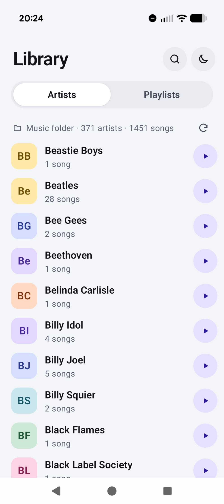
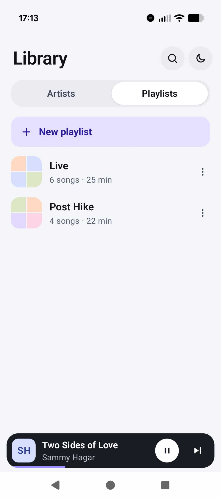

# MP3 Offline

A private, offline MP3 player for Android phones and tablets.

- Finds MP3s in **Internal storage › Music** (sub-folders included)
- Library grouped by **artist**, songs sorted **A–Z by title**
- Play all songs by an artist (in order or shuffled), or a single song
- **Playlists**: create, name, rename, delete, add/remove songs. Songs whose files are gone are removed from playlists automatically (a short notice says how many)
- Background playback with notification, lock-screen and Bluetooth/headset controls
- Light and dark themes (follows the system, or choose in **Appearance**)
- No internet permission, no analytics, no accounts, no ads

<p>
  
  &nbsp;
  
</p>

## Install on your phone or tablet (USB)

MP3 Offline isn't on the Play Store. You install it yourself from a file called an **APK**, which takes about 5 minutes.

### What you need

- An Android phone or tablet running **Android 8.0 or newer** (Settings › About phone › Android version)
- A Windows 10/11 PC or a Mac
- A USB cable that carries **data**, not just charging. The one that came with the phone usually does.
- The app file: **[download mp3-offline.apk](https://github.com/tekewin/mp3-offline/releases/latest/download/mp3-offline.apk)** (always the newest version). Older versions and release notes are on the [Releases page](https://github.com/tekewin/mp3-offline/releases).

> **Tip:** you can skip the cable for the app itself. Open the download link above in your phone's web browser, then follow step 3 of Option A. You'll still want the cable to copy your music over.

There are two ways to install. **Option A** is easiest on Windows. **Option B** is easiest on a Mac, and it works on any device (see the note at the end).

### Option A: copy the file, then tap it (easiest on Windows)

1. **Connect.** Plug the phone into the computer and unlock the phone. Pull down the notification shade, tap the **USB** notification (it may say "Charging this device via USB"), and choose **File transfer**.
2. **Copy the APK to the phone.**
   - **Windows:** open File Explorer. The phone shows up under **This PC**. Open it, open **Internal storage**, then drag the `.apk` file into the **Download** folder.
   - **Mac:** macOS can't see Android phones on its own. Install the free [OpenMTP](https://openmtp.ganeshrvel.com) app, open it, and drag the `.apk` file into the phone's **Download** folder. (Or use Option B, which needs no extra app for file copying.)
3. **Install it on the phone.** Open the **Files** app (on Samsung it's called **My Files**), go to **Downloads**, and tap the `.apk` file.
   - The first time, Android says it isn't allowed to install apps from this source. Tap **Settings**, turn on **Allow from this source**, then go back and tap **Install**.
   - Google Play Protect may warn you that the app is from an unknown developer. Tap **More details › Install anyway**. (It's flagged only because it isn't from the Play Store. The app has no internet permission, so it can't send anything anywhere.)
4. Done. Skip down to **Add your music**.

### Option B: install with ADB (same on Windows and Mac)

ADB is Google's free command-line tool for talking to Android devices over USB. It needs no extra apps on the phone.

1. **Get ADB.** Download **SDK Platform-Tools** for your computer from [Google's page](https://developer.android.com/tools/releases/platform-tools) and unzip it. You'll get a folder called `platform-tools`.
2. **Turn on USB debugging on the phone.**
   - Go to **Settings › About phone** and tap **Build number** 7 times until it says you're a developer. (Samsung: **Settings › About phone › Software information › Build number**.)
   - Go back to Settings and open **Developer options** (often under **System**). Turn on **USB debugging**.
3. **Connect.** Plug in the phone and unlock it. When it asks **Allow USB debugging?**, tick **Always allow from this computer** and tap **Allow**.
4. **Open a command window in the `platform-tools` folder.**
   - **Windows:** open the folder in File Explorer, click the address bar, type `cmd`, and press Enter.
   - **Mac:** open **Terminal**, type `cd ` (with a space after it), drag the `platform-tools` folder into the Terminal window, and press Return.
5. **Check the phone is connected.** Type the command below and press Enter. You should see one line with a serial number and the word `device`.
   - Windows: `adb devices`
   - Mac: `./adb devices`
6. **Install.** Type `adb install ` (Mac: `./adb install `) with a space at the end, drag the `.apk` file into the window, and press Enter. It prints **Success** when done.
7. Optional: turn USB debugging back off in Developer options.

**If `adb devices` shows nothing:** make sure the phone is unlocked and you tapped Allow, and try another cable or USB port. On Windows, some phones also need the maker's USB driver: the [Google USB Driver](https://developer.android.com/studio/run/win-usb) for Pixel phones, or the Samsung Android USB Driver from Samsung's site. Macs don't need a driver.

### Add your music

The app plays MP3 files in the phone's **Music** folder, including sub-folders such as `Music/Artist/Album/`.

- **Option A users:** with the phone still connected for file transfer, drag your MP3s (or whole folders) into **Internal storage › Music**, in File Explorer on Windows or OpenMTP on a Mac.
- **Option B users:** you can copy a whole folder with one command. Type `adb push ` (Mac: `./adb push `), drag your music folder into the window, then type ` /sdcard/Music/` and press Enter.

Then open **MP3 Offline** and tap **Allow** when it asks for access to music. Your songs appear, grouped by artist. If something you just copied doesn't show up right away, give Android a minute to notice the new files.

### Updating and removing

- **To update,** install the newer `.apk` the same way. It replaces the old version and keeps your playlists.
- **To remove,** uninstall it like any other app. This also deletes your playlists. Your MP3 files are not touched.

> **Note on Google's new sideloading rules:** Google is adding a developer check for apps installed from outside the Play Store. It started in a few countries in late 2026 and is planned to go worldwide in 2027. If Option A ever stops with a message about an unverified developer, use **Option B**: Google has said apps installed with ADB are not affected.

## Build from source

1. Install the latest **Android Studio**.
2. **File › Open…** and pick this folder. Let Gradle sync (Studio downloads the SDK and libraries the first time, which needs internet on your PC; the app itself never does).
3. If Studio offers to upgrade the Android Gradle Plugin or libraries, accept: the versions here are known-good, not necessarily the newest.
4. Plug in your phone with USB debugging on (or start an emulator) and press **Run**.
5. Copy some `.mp3` files into the phone's `Music` folder, open the app and allow access to music.

To test on an emulator, drag MP3 files onto the emulator window. They land in `Download`, so move them into `Music` with the Files app.

### Making a release APK (for the maintainer)

The `.apk` people download must be signed. (An unsigned build, `app-release-unsigned.apk`, won't install.)

Signing is set up in `app/build.gradle.kts`: release builds are signed automatically when `keystore.properties` (store file, alias and passwords) sits in the project root next to the key store `mp3offline-release.jks`. Both files are git-ignored.

1. Bump `versionCode` and `versionName` in `app/build.gradle.kts`.
2. Build: double-click `build-release.bat` (or run `gradlew assembleRelease`). The signed APK is copied to `dist\mp3-offline.apk`.
3. On GitHub: **Releases › Draft a new release**, create a tag such as `v1.0.1`, attach `dist\mp3-offline.apk`, and publish. Keep the file name `mp3-offline.apk`: that exact name is what makes the download link above always point at the newest version.

Back up `mp3offline-release.jks` and `keystore.properties` somewhere safe outside this folder. Every future update must be signed with the same key, or Android will refuse to install it over the old version.

## Project layout

```
app/src/main/java/com/tekewin/mp3offline/
├── MainActivity.kt          Edge-to-edge activity, theme switch, player connection
├── MainViewModel.kt         Library state, navigation, playlist actions, auto-prune
├── data/
│   ├── MusicRepository.kt   MediaStore query for MP3s in Music/, grouped by artist
│   ├── PlaylistStore.kt     Playlists as JSON in app-private storage (atomic writes)
│   └── SettingsStore.kt     Light / dark / system preference
├── playback/
│   ├── PlaybackService.kt   Media3 ExoPlayer + MediaSessionService (background play)
│   ├── PlaybackConnection.kt MediaController wrapper exposing a StateFlow to Compose
│   └── Artwork.kt           Embedded cover art (ID3) loader with an in-memory cache
└── ui/                      Jetpack Compose + Material 3 screens matching the design
```

## Design decisions

- **Playlists store file paths, not database ids.** Android's MediaStore can hand out new ids after a rescan or OS update; the file's path (`Music/Artist/Song.mp3`) is stable. If a path disappears, that entry is removed once a later scan, at least 5 minutes after the first miss, still can't find it. The first-missed time is saved with the playlists, so this works across app restarts. Moving or renaming a file counts as removing it.
- **Safety net:** if a scan finds no MP3s at all, playlists are left alone, since that's more likely a storage hiccup than every file being deleted. The two-scan, 5-minute rule above covers the partial case: while Android re-indexes (e.g. after a reboot) it can briefly list only some songs.
- **The playback service only plays MediaStore audio.** Other apps (and the system) can control playback, but they can't make the player open arbitrary files or URLs.
- **Nothing is backed up or shared.** `allowBackup` is off and backup/transfer rules exclude everything.
- **The network permission is explicitly removed** from the merged manifest, so no library can add it.
- Requirements: Android 8.0 (API 26) or newer. Targets Android 16 (API 36).

## Google Play

The app isn't published on Google Play. Notes for publishing it there are in [PLAYSTORE_README.md](PLAYSTORE_README.md).
